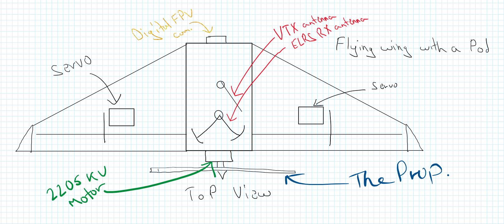
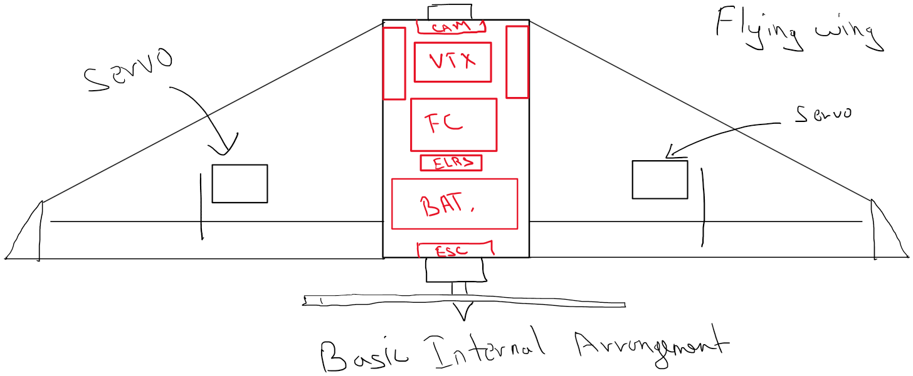

```
---
title: "FlyQ"
author: "Burger"
description: "Fixed-wing ultralight autonomous UAV"
created_at: "2025-06-01"
---
```

# FlyQ
An Ultralight fixed wing autonomous UAV.
Note: Not all parts listed from June 1st-6th are used.

## June 1st
Project inception, I researched on the different types of drones and decided what I want to build. Here is all of the research condensed down for reader's consumption.
Project goals:
 - ultralight
 - should have autonomous flying capabilities with failsafe RTH
 - medium range (4-8 km)
 - cameras
 - fixed wing
 - durable
 
Considering all goals, I have decided:
It is going to be a flying wing design with single rotor at the back (pusher).




Time spent: ~3-4 hrs (research)

## June 2nd
Agenda: Airframe
I am researching on the airframe, how it's going to be made, design desisions, extra provisions etc.
I have decided it is best to buy a commercial frame for it being made out of molded EPP foam goes a long way towards crash resistance (EPP foam compresses and does not break (shatter) like defron sheets if I were to DIY it). There are a few downsides to this, notablily this kinda makes future customization on the drone itself a bit difficult but I think that is acctable considering the other factors.
Time spent: ~2-3 hrs
I had some more time today so I have decided to look into which commercial frame that is readyly available here that can be bought.
I am going for a single prop design as it is cheaper due to only one motor being persent and the cruise current being lower for the same reason.
I've chosen the 'Reptile S800 V2 Flying Wing'

I chose this due to it's avaibility in an Indian store and alignment with the project goals. It's made with EPP ensuring the drone dosen't break on impact.
Time spent: ~3 hrs

## June 3rd
Agenda: Flight Control systems
I'll try to decide which control systems to put on drone as per my budget and other factors like compatibility with Ardupilot/INAV (autonomy), ELRS etc.
I've decided to go with the "SpeedyBee F405 WING MINI Fixed Wing Flight Controller"


It is very light at 23g and supports INAV and Ardupilot. It is well within budget at US$35.99 (around $47 USD in Indian sites)
I've checked out some 40 FCs but this seems to be the best in it's capabilities and price based on the STM32F405. It has integrated IMU, barometer and OSD.

Also selected the GPS module to be used with this FC, it's a Flywoo GOKU GM10 Mini V3 GPS

Time spent: ~4 hrs

## June 4th
Agenda: Other parts
Selecting other parts in accordance with compatibilty with FC, budget and project goals.
### Motor
XING 2205 FPV Motor (12/M2) - 2300KV

Within budget, efficient rating.
### ESC
Readytosky 40A 2-6S Multi-Rotor UAV Drone ESC

Also within budget and has sufficient rating.
### ELRS RX

MATEKSYS ELRS 2.4GHz Vario Receiver ELRS-R24-V
### Camera DVR
https://shop.runcam.com/runcam-mini-fpv-dvr/
It is a RunCam Mini FPV DVR, fits right in budget.

### Camera

It's a Caddx Ant Lite Analog Camera (FPV Cycle Edition) (4:3), cheapest while having great quality.

Time spent: ~6-8 hrs

## June 5th
Remaining electronic stuff for the drone.

### VTX
 SpeedyBee TX800 5.8 GHz VTX
### Battery

 Samsung INR18650-35E 7.4V 3500mAh 2C 2S1P Li-ion Battery Pack
### VTX Antenna

Pagoda 2 Antenna 5.8GHz with cover

Time spent: ~4-5 hrs

## June 6th
Ground station stuff

### VRX

5.8G UVC OTG Android AV Phone Receiver

> ## Budget check (retail prices at 1USD = 85.76INR)
>  Airframe - $49.05
>  FC - $39.77
>  GPS - $19.80
>  Motor - $9.32
>  ESC (!!) - $8.71
>  ELRS RX - $29.71
>  DVR - $17.99
>  Camera - $18.80
>  VTX - $28 USD 
>  Battery - $12.57
>  Antenna (drone) - $4.19
>  ### Total till now - $ 246.94
Prices taken from best retailers found.

Time spent: 4.5 hrs

## Break
I took a break. Returned on June 15th

We can do better. Revamping materials and stategry to bring this greatly under budget.
### To do so, we're changing the following:
- Allowing imports
- Frame
- FC
- Camera and VTX

I lost of count of time spent on doing this, I have been at it for 2+ days at this point.

But I have selected all the new parts.

> I've listed the new parts below, the cateories that aren't listed have kept their initial selection.
> GPS - HGLRC M100 5883 GPS Module M10 Chip with QMC 5883 Compass Ceramic Antenna - $14.39
> Motor - Readytosky 2205 2300KV 3-4S CW CCW Brushless Motor -  $8.69
> ESC - Generic ESC 30A - $4
> ELRS RX - Radiomaster RP3 ExpressLRS ELRS 2.4GHz LNA+PA Dual Antenna Nano Diversity Receiver for Whoops FPV RC Racing Drone Airplane - $21.73
> FPV setup, full (VTX, VRX, Camera, Antenna Combo) - Eachine Sphere Link 5.8GHz WIFI Digital HD 800mW - $67.35
> Servo - TowerPro SG90 9G Mini - $4

This brings the drone hardware cost below $170 (from ~$250)

Below is the design for the drone airframe, it's going to be built out of XPS foam boards, supported by carbon fiber spars and reinforced with packing tape.




For Accurate wiring, I'd need to have the hardware in hand, so I will not be able to do that until the parts arrive.

For firmware, I'd be using INAV 6.0 for autonomy and Rocketmaster Pocket for ELRS control link, and using it will passthrough telementry data to the ground station.

I am also designing a custom PCB DVR for the drone, it will be used to record the video feed from the camera on the drone onto a SD card onboard for even higher image quality and data recovery.

For FPV setup, I will be using the Eachine Sphere Link 5.8GHz WIFI Digital HD 800mW, which is a combo of VTX, VRX, Camera and Antenna. It is a digital setup and will provide much better image quality than analog setups, at a cost that is cheaper than most.

For the FPV ground viewing, I'd be using a phone initially with plans to bind it with a rpi02w soon.

I have carefully selected all the parts to ensure they are compatible with each other and fit within the budget. I have also taken into account the weight of each component to ensure the drone remains ultralight.

XPS foam boards are great for this project as they are lightweight and help me keep the drone within limits.

This concludes Part 1 of the FlyQ project.

spent ~15 days designing, refining and finalizing the design, parts and budget.