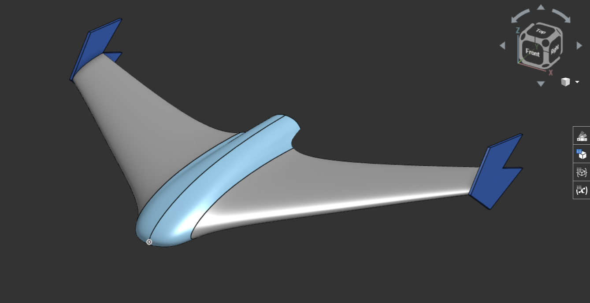

# FlyQ
An Ultralight fixed wing autonomous UAV.
Note: Not all parts listed from June 1st-6th are used.

## June 1st
Project inception, I researched on the different types of drones and decided what I want to build. Here is all of the research condensed down for reader's consumption.
Project goals:
 - ultralight
 - should have autonomous flying capabilities with failsafe RTH
 - medium range (4-8 km)
 - cameras
 - fixed wing
 - durable
 
Considering all goals, I have decided:
It is going to be a flying wing design with single rotor at the back (pusher).

Time spent: ~3-4 hrs (research)

## June 2nd
Agenda: Airframe
I am researching on the airframe, how it's going to be made, design desisions, extra provisions etc.
I have decided it is best to buy a commercial frame for it being made out of molded EPP foam goes a long way towards crash resistance (EPP foam compresses and does not break (shatter) like defron sheets if I were to DIY it). There are a few downsides to this, notablily this kinda makes future customization on the drone itself a bit difficult but I think that is acctable considering the other factors.
Time spent: ~2-3 hrs
I had some more time today so I have decided to look into which commercial frame that is readyly available here that can be bought.
I am going for a single prop design as it is cheaper due to only one motor being persent and the cruise current being lower for the same reason.
I've chosen the 'Reptile S800 V2 Flying Wing'

I chose this due to it's avaibility in an Indian store and alignment with the project goals. It's made with EPP ensuring the drone dosen't break on impact.
Time spent: ~3 hrs

## June 3rd
Agenda: Flight Control systems
I'll try to decide which control systems to put on drone as per my budget and other factors like compatibility with Ardupilot/INAV (autonomy), ELRS etc.
I've decided to go with the "SpeedyBee F405 WING MINI Fixed Wing Flight Controller"

It is very light at 23g and supports INAV and Ardupilot. It is well within budget at US$35.99 (around $47 USD in Indian sites)
I've checked out some 40 FCs but this seems to be the best in it's capabilities and price based on the STM32F405. It has integrated IMU, barometer and OSD.

I've read the INAV and Ardupilot docs to compare which one would be simpler for my use case. As I see, Ardupilot is a much more sophisticated solution for drone piloting, while [INAV](https://github.com/iNavFlight/inav) is simpler, and fits my usecase better, which is autonomy for some time, not very long range ops.

In my search for a good FC, I initially came across Matek F405-Wing, which is a nice FC and what I was going to use until I continued searching and found the SpeedyBee F405 Wing Mini, which is much lighter than the Matek version. I also came across the Matek F722-Wing, it is also a nice FC, a little too nice, it's too expensive for this lightweight platform. Betaflight FCs (F411s etc) were too slow to support everything and that kinda raised some questions about it's stabilty running everything.
This FC was a stack option containing PDBs and current sensors inbuilt. Also has Barometers for altitude measurement. 
My search for the FC was narrowed down with the help of INAV docs with which I could tell if it had the minimum requirements for my needs, as it needed to run INAV. (ref feature 1 [here](https://github.com/iNavFlight/inav?tab=readme-ov-file#features))
Read some more about flying with INAV here [https://github.com/iNavFlight/inav/blob/master/docs/INAV_Fixed_Wing_Setup_Guide.pdf](https://github.com/iNavFlight/inav/blob/master/docs/INAV_Fixed_Wing_Setup_Guide.pdf) and [https://github.com/iNavFlight/inav/blob/master/docs/Navigation.md](https://github.com/iNavFlight/inav/blob/master/docs/Navigation.md)

Also selected the GPS module to be used with this FC, it's a Flywoo GOKU GM10 Mini V3 GPS

Time spent: ~4 hrs

## June 4th
Agenda: Other parts
Selecting other parts in accordance with compatibilty with FC, budget and project goals.
### Motor
XING 2205 FPV Motor (12/M2) - 2300KV

Within budget, efficient rating.
This is a popular FPV motor within FPV circles. At 2300KV, it produces enough thrust to cruise comfortably with just the right amount of energy. It's reliable, lightweight and efficient, ideal for this project.
### ESC
Readytosky 40A 2-6S Multi-Rotor UAV Drone ESC

Also, within budget and has a sufficient rating.
At 40A, this is more than enough for what the motor will ever experience, with enough headroom for boosts past the normal every once in a while. It is reasonably priced and well-known.
### ELRS RX

MATEKSYS ELRS 2.4GHz Vario Receiver ELRS-R24-V
This is an important component (although one could say this for all of them). It's an [ELRS](https://www.expresslrs.org/) receiver, which stands for [Express Long Range System](https://www.expresslrs.org/), is a "High Performance Open Source Radio Control Link" optimised for long range and low latency. Read a lot in the [ELRS docs](https://www.expresslrs.org/software/mavlink/). It can pull some long-range (50+ km) stuff even on 2.4 GHz.

### Camera DVR

It is a RunCam Mini FPV DVR, fits right in the budget. 
It was meh, i didn't quite like it as it can't record in HD but I guess for that price it's the best I can get.

### Camera

It's a Caddx Ant Lite Analog Camera (FPV Cycle Edition) (4:3), cheapest while having great quality.
Its cheap, at this price point it's hard to beat. Great for this build.
This is cool, cheap and probably not the camera for drones so would need to hack it for it to work with the FC and VTx.

Spent a lot of time reading the ELRS and INAV docs. Also got help from the Oscar Liang blog. Spent some time researching batteries.

Time spent: ~6-8 hrs

## June 5th
Remaining electronic stuff for the drone.

### VTX
 SpeedyBee TX800 5.8 GHz VTX
 One of the few available VTxs here, it's cheap-er than most and the transmit power is under limits and enough for mid range stuff.
### Battery

 Samsung INR18650-35E 7.4V 3500mAh 2C 2S1P Li-ion Battery Pack
 Nice value for the battery pack, it's good that it's made by robu and sold by robu.
### VTX Antenna

Pagoda 2 Antenna 5.8GHz with cover
Good antenna, cheap, would be used for the drone VTx.

Time spent: ~4-5 hrs

## June 6th
Ground station stuff

### VRX

5.8G UVC OTG Android AV Phone Receiver

> ## Budget check (retail prices at 1USD = 85.76INR)
>  Airframe - $49.05
>  FC - $39.77
>  GPS - $19.80
>  Motor - $9.32
>  ESC (!!) - $8.71
>  ELRS RX - $29.71
>  DVR - $17.99
>  Camera - $18.80
>  VTX - $28 USD 
>  Battery - $12.57
>  Antenna (drone) - $4.19
>  ### Total till now - $ 246.94
Prices taken from the best retailers found. That took too long. Finding the cheapest non-scammy retailer for niche stuff is a bit hard. More so in India, thankfully, I was able to find retailers for all the parts. 

Ah, Houston, we have a problem.
That price is too high; it's more than I thought for just this part of the project. I must do something about it. I suppose I'd have to allow myself to import and change parts for better, more cost-effective alternatives. 

Did some research on drone parts from YouTube and Oscar Liang's blog. They are a nice resource on builds like these, not just these but most other builds would benifit from the infomative blogs and youtube reviews.
Time spent: 4.5 hrs

## Break
I took a break. Returned on June 15th

We can do better. Revamping materials and stategry to bring this greatly under budget.
### To do so, we're changing the following:
- Allowing imports
- Frame
- FC
- Camera and VTX

I lost of count of time spent on doing this, I have been at it for 2+ days at this point.

But I have selected all the new parts.

> I've listed the new parts below, the cateories that aren't listed have kept their initial selection.
> GPS - HGLRC M100 5883 GPS Module M10 Chip with QMC 5883 Compass Ceramic Antenna - $14.39
> Motor - Readytosky 2205 2300KV 3-4S CW CCW Brushless Motor -  $8.69
> ESC - Generic ESC 30A - $4
> ELRS RX - Radiomaster RP3 ExpressLRS ELRS 2.4GHz LNA+PA Dual Antenna Nano Diversity Receiver for Whoops FPV RC Racing Drone Airplane - $21.73
> FPV setup, full (VTX, VRX, Camera, Antenna Combo) - Eachine Sphere Link 5.8GHz WIFI Digital HD 800mW - $67.35
> Servo - TowerPro SG90 9G Mini - $4

This brings the drone hardware cost below $170 (from ~$250)

Below is the design for the drone airframe, it's going to be built out of XPS foam boards, supported by carbon fiber spars and reinforced with packing tape.

For Accurate wiring, I'd need to have the hardware in hand, so I will not be able to do that until the parts arrive.

For firmware, I'd be using INAV 6.0 for autonomy and Rocketmaster Pocket for ELRS control link, and using it will passthrough telementry data to the ground station.

I am also designing a custom PCB DVR for the drone, it will be used to record the video feed from the camera on the drone onto a SD card onboard for even higher image quality and data recovery.

For FPV setup, I will be using the Eachine Sphere Link 5.8GHz WIFI Digital HD 800mW, which is a combo of VTX, VRX, Camera and Antenna. It is a digital setup and will provide much better image quality than analog setups, at a cost that is cheaper than most.

For the FPV ground viewing, I'd be using a phone initially with plans to bind it with a rpi02w soon.

I have carefully selected all the parts to ensure they are compatible with each other and fit within the budget. I have also taken into account the weight of each component to ensure the drone remains ultralight.

XPS foam boards are great for this project as they are lightweight and help me keep the drone within limits.

This concludes Part 1 of the FlyQ project.

spent ~15 days designing, refining and finalizing the design, parts and budget.

## 27th June
wait a second, wasn't that the end?
apparently not, there's more to come.

Designed with a meticulous selection of components to achieve a compact, efficient, and high-performance system.

I present you FlyQ, the ultralight fixed-wing autonomous UAV.

.stl files in root

# Summery:

Bit of a rewrite, but this improves the formatting of the initial part (sourcing parts [new ones])

Let us recap the project goals
Project goals:
 - ultralight
 - should have autonomous flying capabilities with failsafe RTH
 - medium range (4-8 km)
 - cameras
 - fixed wing
 - durable

|Sr. No.|Image                                                                                                                       |Name                                                                              |Category   |Sub-Category|Main Use         |Considerations while choosing                                                                                                    |Cost  |Extra remarks                                                                                                  |
|-------|----------------------------------------------------------------------------------------------------------------------------|----------------------------------------------------------------------------------|-----------|------------|-----------------|---------------------------------------------------------------------------------------------------------------------------------|------|---------------------------------------------------------------------------------------------------------------|
|1      |https://cdn11.bigcommerce.com/s-fhxxhuiq8q/images/stencil/500x500/products/240/1367/SB_WING-MINI-1__04828.1707096339.jpg?c=2|SpeedyBee F405 WING MINI Fixed Wing Flight Controller                             |Electronics|Main control|Flight Controller|Cheap, Very light, Support INAV/Ardupilot, built in barometer, current sensor, OSD and UART capabilities, ecosystem. Entire stack|$39.00|Will probably buy from Banggoods as while it's $2 cheaper when directly compared, the shipping cost takes ~$15.|
|2      |https://m.media-amazon.com/images/I/51ASMWWGR7L._UF1000,1000_QL80_.jpg                                                      |HGLRC M100 5883 GPS Module M10 Chip with QMC 5883 Compass Ceramic Antenna         |Electronics|Main control|GPS              |Cheap, Has Compass, Accuracy, Latest M10 chip, Has a compass, Lightweight                                                        |$13.00|                                                                                                               |
|3      |https://m.media-amazon.com/images/I/41W5V3w09pL._UF350,350_QL80_.jpg                                                        |Readytosky 2205 2300KV 3-4S CW CCW Brushless Motor                                |Electronics|Main control|Motor            |Well known FPV motor, reletively lightweight                                                                                     |$8.69 |India shop                                                                                                     |
|4      |https://ae01.alicdn.com/kf/Sd7f9c6000a61405a96563ed8aa87b3907.jpg_960x960.jpg                                               |Readytosky 40A 2-4S ESC with 3.5mm Banana Connector                               |Electronics|Power       |ESC              |Well known FPV ESC, within limits, reletively lightweight and cheap                                                              |$6.14 |would have bought the 30A 2-4S varient for a dollar less if it was in stock; Have to solder connections        |
|5      |https://ueeshop.ly200-cdn.com/u_file/UPAX/UPAX406/2308/23/photo/RP3-V2-Detail-Page-EN-Mobile01-9e6f.jpg                     |Radiomaster RP3 ExpressLRS ELRS 2.4GHz LNA+PA Dual Antenna Nano Diversity Receiver|Electronics|RF          |ELRS RX          |Best range vs. Cost, Reletively cheap                                                                                            |$20.00|Have to solder connections                                                                                     |
|6      |https://imgaz3.staticbg.com/thumb/large/oaupload/banggood/images/78/EF/4299da5d-869b-45a3-80de-5bc60856469b.jpg.webp        |Eachine Sphere Link 5.8GHz WIFI Digital HD                                        |Electronics|Accessory   |FPV system       |Unbeatable price for a HD FPV system (Camera + VTX + Reciever)                                                                   |$70.00|                                                                                                               |
|7      |https://encrypted-tbn0.gstatic.com/images?q=tbn:ANd9GcSmdgw4eVREMJC2hH6P0phcIXBU7NcqDeXbFA&s                                |Pro-Range Propellers 6042(6X4.2) Tri Blade Flash 2CW+2CCW 2 Pair Pack- Black      |Structural |Thrust      |Prop.            |Cheap, within parameters. Aerodynamic efficiency                                                                                 |$3.00 |                                                                                                               |
|8      |https://encrypted-tbn0.gstatic.com/images?q=tbn:ANd9GcRjw1WUnR5fEDjanitMtx7iaRLjqHcGkv8usQ&s                                |Samsung INR18650-35E 7.4V 3500mAh 2C 2S1P Li-ion Battery Pack                     |Electronics|Power       |Battery          |Cheap, Good Wh vs. Price                                                                                                         |$12.00|                                                                                                               |

# July - A FPV Monitor
## July 5th
I named it July, cause why not. July is a 1080p Touch screen dual antenna SOM based device that can run software to easily access OpenIPC video stream from the Eachine sphere link. Open source and easy to use, just turn it on, connect to pixel pilot and done! 

Easily one of the most poweful and long range FPV monitors out there. There aren't many out there too y'know. 

Researched a lot on OpenIPC tech, the CM5, Raxda, RTL8812AU wifi modules and a lot of things. Here is a brief summery of it all.

### Brains, yes, a monitor needs a brain too
I've decided its best to use a SOM (System on Module).
- well, I could use a SBC like RPI Zero 2 W, but that would be tedious to put on a PCB, then the connections from it would need to be hacked to support everything.
- another option is a CM5 board, reletively easier to put on a board and do all the stuff

After reading through the docs at OpenIPC's website and github, I have come to the conclusion that the Radxa ZERO 3W is the recommended SBC for a ground station.
> #### What is a Ground station?
> A ground station is a place from where the drone is being controled and supervised, it recieves all* the radio comms from the drone and proceeses it for the controller to get enough infomation about the whereabouts of the drone.

It's an epic SBC, and it's actually most recommended for this (being a ground station)

But as you can see, its unmountable on a PCB so we gotta improvise, lets think 🤔

Ah ha! We can use the GPIO and connections (USB and DSI connectors) for the connections to required modules.
Now with our SBC decided, lets select our WIFI 5GHz module
> random note: I currently have at least a 100 chrome tabs open and more than 50% of those are aliexpress and alibaba sites :help:

So, after reading a lot of docs and talking with some people associated with the hobby, who are much more experienced than me, I found out that these are my current options:
- RTL873xBU
- RTL8812AU
	- BL-R8812AF1  (uses the above chip)
- RTL8812EU
	- BL-M8812EU2 (uses the above chip)

So let's remove RTL873xBU from the list, why?
- it's tiny, hence very low power, it might be fine for tinywoops but not for long range builds like this

well, moving on to RTL8812AU, let's see:
- its a oldie in this community, hence proven 
- a bit expensive
- It is said to have exceptional performence

That sounds nice, let's discuss our last one and get back to this

last but not the least, RTL8812EU:
- it's new, unproven but at this point we can probably call it middle aged? idk
- cheap, very.
- It works, it's great for transmit bit, but fine for recieving I guess, the transmit powers are impressive tho, 800mW!

I guess we have our winner! It's RTL8812AU!
We'll try to quickily find a suitable board that supports this chip to attach in the monitor along with the SBC.

Found it, just took half an hour, this sheet dosen't do justice to the time spent searching for stuff.

This is it! we got it.
This is a RTL8812AU based network card that we're gonna connect. It's powerful and will help us recieve the signals.

> remember this random Aliexpress coupon i found FSUK06, SBPWMFT3LE95 (navarcer audio)

That's it for now, let's think what more do we need.

## July 6th

Good Morning! (Good evening or Good night) choose your greeting based on when you're reading this, (I missed out on Good afternoon but who'd read this at noon, i usually take a nap then /jk)
Got some good news and some bad news. Bad News first: We can't use the Raxda Zero 3W, it laggy laggy, it doesn't have enough power for what we want to do. As some people with more experience have informed, that would not be the best way to go forward with this. 
Good news: they also recommended the way to actually go forward with this, behold the Radxa ROCK 4D 

About the Raxda 4D, it's a capable SBC which can do a lot of things, the things which interest us are it's processing abilities and GPU power in which it excels enough.
So that's what we're going to use.

I am writing this blog 'after the fact' so I am going to miss some research, but it is what it is. 

Well, talking about being what it is, we need to select more stuff, we need to get the monitor, power supply, make the wiring diagram for all of this.
Before that, let's select the special antennas we need for this
For our medium range goals we need an antenna with at least 10+ dBi gain to get the video signal.
After scouring Aliexpress for hours, I think I have found one that'll actually work.

This thing is a 17dBi gain linearly polarized antenna capable to listening in to the faintest signal. Along with this, I got a 8dBi omni directional antenna should the drone go out of the field of view of this antenna.

Here's an accounting sheet for the project, it contains all the parts I have ordered in relation to it, by all, I actually mean all, even the itty bitty ones.
You can check it out [here](https://docs.google.com/spreadsheets/d/1skVhD2z50aWqVVDrjqqTZmjcNkN75A2qXTNfnrAGnOc/edit?usp=sharing).

Now that we have this antenna too, let's discuss some more about the monitor itself, first of all, we need an monitor

found one, this is a one cheap excellent display, it is a 7" display and prefectly fits in our monitor case.

time spent: ~4-5 hrs

## July 7th
Hello again, good to see you back here. Let's make a rudementry design for the whole thing (with all the parts)

Yep, that's the plan, and there's a battery in the back (it'll be a 10000mAh powerbank I have)

that's it for the physical stuff I think.

Now let's talk software. Geez, it's been long, finally I can close the AliExpress tabs. Wait a moment, I gotta close a few chrome windows.
*angry chrome noises*
ya, let's get to discussing software.

The FPV Camera uses OpenIPC, which is a protocol made initially for easy viewing with IP cameras which hobbiesyt quickly modifed to work with drones. At the basic level, it uses WFB-ng which is the next generation of long range packet radio based on the wifi radio.

a snippet directly from the px4 docs
>## WFB-ng Overview
>
> The  _WFB-ng project_  provides a data transport that use low-level WiFi packets to avoid the distance and latency limitations of the ordinary IEEE 802.11 stack.
>
>The high level benefits of  _WFB-ng_  include:
>
>-   Low-latency video link.
>-   Bidirectional telemetry link (MAVLink).
>-   TCP/IP tunnel.
>-   Automatic TX diversity - use multiple cards on the ground to avoid antenna tracker.
>-   Full link encryption and authentication (using  [libsodium](https://doc.libsodium.org/)).
>-   Aggregation of MAVLink packets (pack small packets into batches before transmitting).
>-   Enhanced  [OSD](https://github.com/svpcom/wfb-ng-osd)  for Raspberry PI or generic linux desktop with gstreamer.

In a gist, it helps us establish a TCP/IP tunnel from the drone to the Groundstation so we can stream video + telemetry. This is cool open source software which everyone should be able to access and hack for their own use. That's what makes it even more cooler.

As you'd see, I am using a RTL8812au (for receiving) which is in the [list of supported modules](https://github.com/svpcom/wfb-ng?tab=readme-ov-file#supported-wifi-hardware), so that's great!
For our Raxda pi we'd follow the basic guidelines and then start with our custom approach to modify settings for the best link reliability and bitrate.

time spent: ~4 hr

## July 8th

After reading OpenIPC docs in depth, I realized this is 
I should have known about it ages ago.

I am reading the OpenIPC installation docs (https://github.com/OpenIPC/wiki/blob/master/en/installation.md) to better understand it all.

Okay, after a lot of talking with more established community members, here is a snippet of what they said when i later went on to confirm my final selection of the stuff.

So, I guess we're back to the Raxda zero 3W, which is actually good news! It's apprently works more reliably and is cheaper too!
For people who forgot what the zero 3W looked like:

It's actually great as I already talked about in my july 6th entry. We're mainly interested in the processing power of the device and it's video decoding capabilities and the zero 3W has plenty of both. It uses a Rockchip RK3566 SoC which has the Quad‑core Arm® Cortex®‑A55 (Armv8) 64‑bit @ 1.6GHz and a Arm® Mali™‑G52‑2EE as GPU. Both good.

It has the HDMI port so that's what we're going to use to connect to the display.
Honestly tho, I might just resolder the HDMI connection pointing inwards, it's just at the edge so it kinda sucks, a cable outwards may work but let's see.

time spent: ~2 hrs

## July 9th

Let's make a custom RPI type uHAT to integrate this all into the Radxa Zero 3W easily.
The uHAT would act as our interface with the outside so we'd be adding a few buttons and a temp probe to it too.
An OLED screen would be nice too, it'll act as a status indicator for the device and show some basic info like IP address, temperature, battery level etc.
What else? A few LEDs to indicate the status of the device, like if it's on, if it's connected to the drone, if it's recording etc.

> extra note, midway through designing the uHAT, I realized that the uHAT can be actually also used as a adapter for a phone so it can be used with the pixelpilot app too, which is kinda RAD, even smaller footprint! Will definetly try to make it work with a phone too.
 

# June 15th

Did a lot of work in the last week, I realized that just custom designing everything is not efficient always BUT ITS THE BEST THING YOU CAN DO!

So I did, the HAT supports powering the zero 3W from a battery connection directly, connects the BL-R8812AF1 module with the computer and also powers it, acts as the main interface for the thing too (houses the buttons on a diff. board)
> random note: walmart sells these chips?! https://www.walmart.com/ip/RTL8812AU-BL-R8812AF1-Wireless-Module-1200M-Dual-Band-AC-Smart-Multifunction-Convenient-Wifi-High-Power-Module/5468431768

kinda took too long but happy that it's done.
this provides power to both the SBC and the BL-R8812AF1 module from the battery connection, connects the BL-R8812AF1 module to the SBC via USB GPIO. (remember to do the changes on the SBC to make it work with the USB GPIO)

