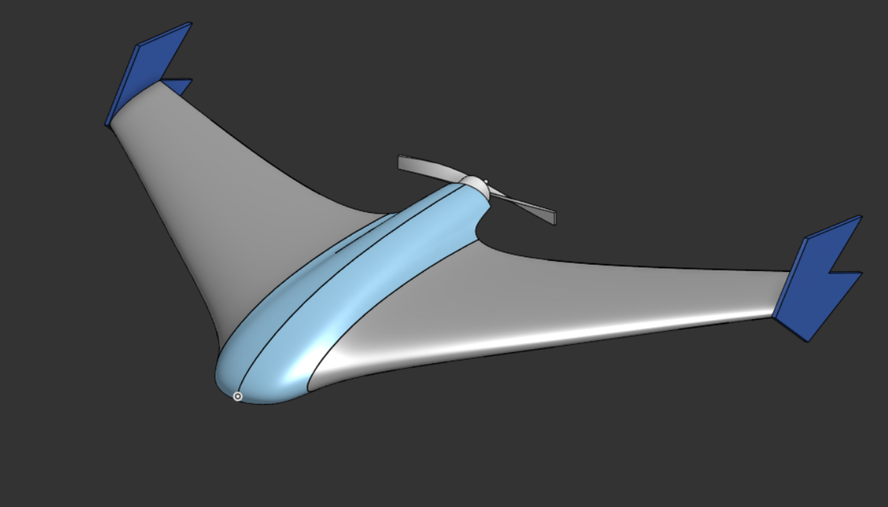
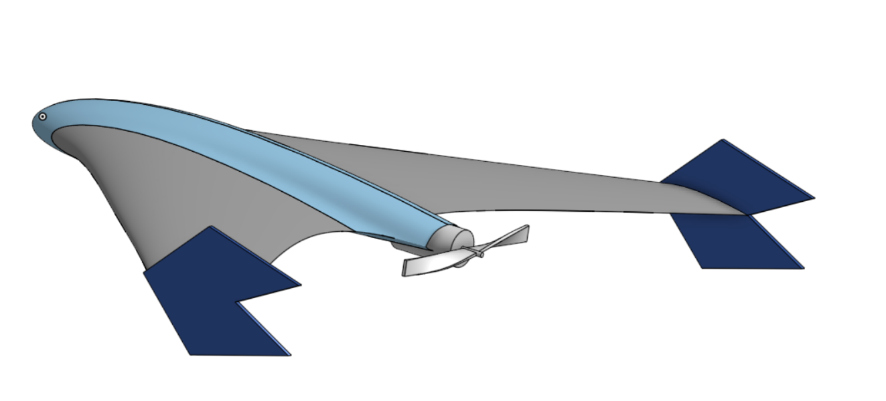
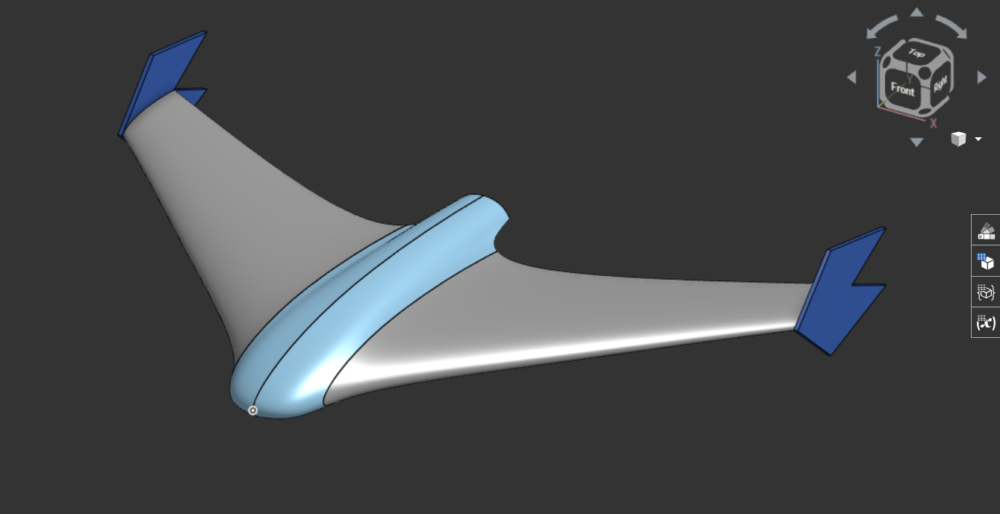
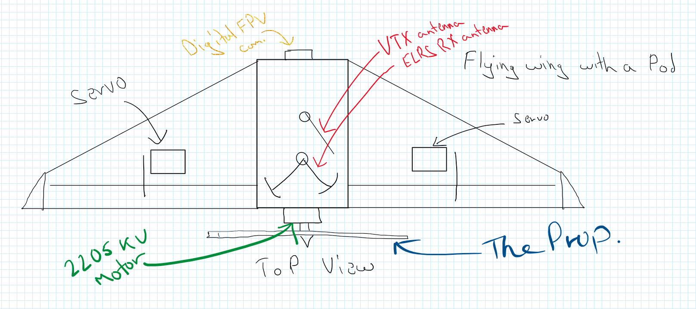
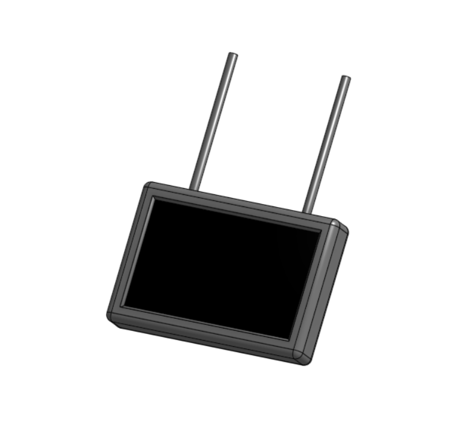

# FlyQ & FPV Monitor
An Ultralight fixed-wing autonomous UAV. It is designed to be a flying wing with a single pusher propeller at the back. The airframe is made of XPS foamboard for lightweight-ness.
I plan to eventually fly it with a sidestick.

Why?
It all started with [this video by rctestflight](https://www.youtube.com/watch?v=ULlNktaOUy8), I think. I was fascinated by the idea of a fixed-wing flying objects that and the pictures it captured. I wanted to build something like that, but I wanted it to be ultralight and autonomous. So I started researching on the different types of drones and decided what I want to build. I wanted to start a YSWS with this too (#firefly plug) that is basically this. I am happy I am able to get this far with it.

# July the FPV Monitor
This is a custom monitor based on openIPC to stream video from the UAV.

List:
- [x] Finalise Project Goals
- [x] Finalised Parts List
- [x] Finalised Budget
- [x] Finalised Design
- [x] Tech Work, Arch.

## BOM

| Category                | Component Name                                                                     | Part Number   | Quantity | Unit Cost | Total Cost | Supplier                  | Link                                                                                                                                                                                                                                                                                                                                                                                                                                           |
| ----------------------- | ---------------------------------------------------------------------------------- | ------------- | -------- | --------- | ---------- | ------------------------- | ---------------------------------------------------------------------------------------------------------------------------------------------------------------------------------------------------------------------------------------------------------------------------------------------------------------------------------------------------------------------------------------------------------------------------------------------- |
| FC                      | SpeedyBee F405 WING MINI Fixed Wing Flight Controller                              | 2008125       | 1        | $38.54    | $38.54     | Speedybee via Banggoods   | [https://www.banggood.com/SpeedyBee-F405-WING-MINI-Fixed-Wing-Flight-Controller-Support-INAV-Ardupilot-VTOL-for-RC-Airplane-p-2008125.html?cur_warehouse=CN](https://www.banggood.com/SpeedyBee-F405-WING-MINI-Fixed-Wing-Flight-Controller-Support-INAV-Ardupilot-VTOL-for-RC-Airplane-p-2008125.html?cur_warehouse=CN)                                                                                                                       |
| GPS                     | HGLRC M100 5883 GPS Module M10 Chip with QMC 5883 Compass Ceramic Antenna          | 1993147       | 1        | $13.95    | $13.95     | HGLRC via Banggoods       | [https://www.banggood.com/HGLRC-M100-5883-GPS-Module-M10-Chip-with-QMC-5883-Compass-Ceramic-Antenna-for-RC-Drone-FPV-Racing-Helicopter-Airplane-p-1993147.html?cur_warehouse=CN&ID=522225](https://www.banggood.com/HGLRC-M100-5883-GPS-Module-M10-Chip-with-QMC-5883-Compass-Ceramic-Antenna-for-RC-Drone-FPV-Racing-Helicopter-Airplane-p-1993147.html?cur_warehouse=CN&ID=522225)                                                           |
| Motor                   | Readytosky 2205 2300KV 3-4S CW CCW Brushless Motor                                 | 447-M-020     | 2        | $8.66     | $8.66      | Readytosky via Evelta     | [https://evelta.com/readytosky-2205-2300kv-3-4s-cw-ccw-brushless-motor/?](https://evelta.com/readytosky-2205-2300kv-3-4s-cw-ccw-brushless-motor/?)                                                                                                                                                                                                                                                                                             |
| ESC                     | Readytosky 30A 2-4S ESC with 3.5mm Banana Connector                                | 447-E-064-B21 | 1        | $5.51     | $5.51      | Readytosky via Evelta     | [https://evelta.com/readytosky-30a-2-4s-esc-with-3-5mm-banana-connector/](https://evelta.com/readytosky-30a-2-4s-esc-with-3-5mm-banana-connector/)                                                                                                                                                                                                                                                                                             |
| ELRS RX                 | Radiomaster RP3 ExpressLRS ELRS 2.4GHz LNA+PA Dual Antenna Nano Diversity Receiver | 1978249       | 1        | $19.95    | $19.95     | Radiomaster via Banggoods | [https://www.banggood.com/Radiomaster-RP3-ExpressLRS-ELRS-2_4GHz-LNA+PA-Dual-Antenna-Nano-Diversity-Receiver-for-Whoops-FPV-RC-Racing-Drone-Airplane-p-1978249.html](https://www.banggood.com/Radiomaster-RP3-ExpressLRS-ELRS-2_4GHz-LNA+PA-Dual-Antenna-Nano-Diversity-Receiver-for-Whoops-FPV-RC-Racing-Drone-Airplane-p-1978249.html)                                                                                                       |
| DVR                     |                                                                                    |               |          |           |            |                           |                                                                                                                                                                                                                                                                                                                                                                                                                                                |
| Battery Charger | TooklitRC M6D Charger                                         | 2025007       | 1        | $40.00    | $40.00     | TookkitRC via Amazon     | [https://www.banggood.com/Eachine-Sphere-Link-5_8GHz-WIFI-Digital-HD-800mW-FPV-Transmitter-VTX-with-1080P-FOV-140-FPV-Camera-MAVLINK-Protocol-Based-on-OpenIPC-for-RC-Drone-p-2025007.html?cur_warehouse=CN&ID=6329786](https://www.amazon.in/ToolkitRC-Screen-Multi-Function-Charger-Diagnostics/dp/B07W2X7L6D) |
| Prop                    | Pro-Range Propellers 6042(6X4.2) Tri Blade Flash 2CW+2CCW 2 Pair Pack- Black       |               | 1        | $2.97     | $2.97      | Pro-range via Robu.in     | [https://robu.in/product/orange-hd-604260x4-2-tri-blade-flash-propellers-2cw2ccw-2-pair-black/](https://robu.in/product/orange-hd-604260x4-2-tri-blade-flash-propellers-2cw2ccw-2-pair-black/)                                                                                                                                                                                                                                                 |
| Battery                 | Samsung INR18650-35E 7.4V 3500mAh 2C 2S1P Li-ion Battery Pack                      |               | 1        | $12.00    | $12.00     | Pro-range via Robu.in     | [https://robu.in/product/samsung-inr18650-35e-7-4v-3500mah-2c-2s1p-li-ion-battery-pack/](https://robu.in/product/samsung-inr18650-35e-7-4v-3500mah-2c-2s1p-li-ion-battery-pack/)                                                                                                                                                                                                                                                               |
| Controller              | RadioMaster Pocket 2.4 GHz ELRS                                                    |               | 1        | $69.30    | $69.30     | Radiomaster via RCMumbai  | [https://rcmumbai.com/products/radiomaster-pocket-pre-order?variant=50865323180313](https://rcmumbai.com/products/radiomaster-pocket-pre-order?variant=50865323180313)                                                                                                                                                                                                                                                                         |
| Drone Airframe          | LW-PLA                                                                          |               | 1        | $35     | $35      | Generic via Amazon        |  [https://3dzone.in/polymaker-polylite-lw-pla-filament-1-75-0-8kg/?attribute_pa_color=black](https://3dzone.in/polymaker-polylite-lw-pla-filament-1-75-0-8kg/?attribute_pa_color=black)                                                                                                                                                     |
| Drone Airframe          | Carbon Fiber Spars                                                                 |               | 1        | $3.22     | $3.22      | Generic via Robu.in       | [https://robu.in/product/pultruded-carbon-fiber-tube-hollow-3mmod-1-5mm-id-1000mm-pack-of-2](https://robu.in/product/pultruded-carbon-fiber-tube-hollow-3mmod-1-5mm-id-1000mm-pack-of-2)                                                                                                                                                                                                                                                       |
| Misc.                   | Misc.                                                                              |               |          | $15.00    | $15.00     |                           |                                                                                                                                                                                                                                                                                                                                                                                                                                                |
| Price Increases.                   | Misc.                                                                              |               |          | $35.00-40.00    | $35-40.00     |                           |                                                                                                                                                                                                                                                                                                                                                                                                                                                |
|                         | Total                                                                              |               |          |           | ~$250    |                           |                                                                                                                                                                                                                                                                                                                                                                                                                                                |
> Price Increases in the above table refer to the increase in price due to a sale ending in Banggoods (Hobby days), from where I am sourcing some parts, this is to offset that cost. 
> Misc. refers to other stuff I may need during the build, Plastic Glue, shipping costs to mohid to ship a few things etc. 

Onshape: https://cad.onshape.com/documents/3a31bd101055f48e2c57a97f/w/3223f853520e071ef3d94c1a/e/74b33148177611be13b0c74b
